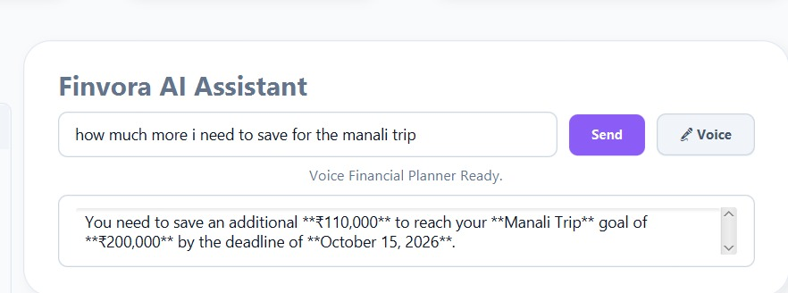
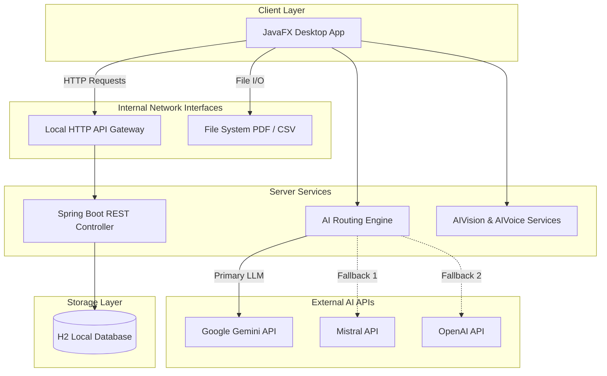
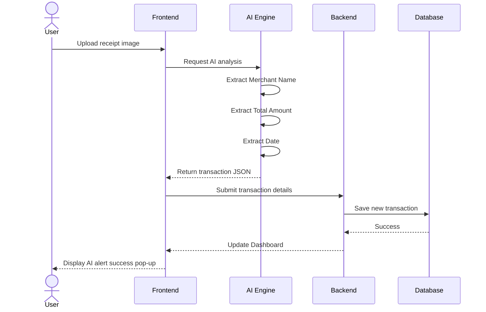

<div align="center">
  
</div>

<br />

<div align="center">
<p>A production-grade, AI-powered personal finance tracker — with multi-LLM interactions, voice-activated logging, automated receipt scanning, and robust wealth management.</p>
<br />

<a href="LICENSE"></a>
 
<a href="https://github.com/yuvanvishnupandi/Finance_Tracker_APP/stargazers"></a>
 
<a href="https://github.com/yuvanvishnupandi/Finance_Tracker_APP/commits/main"></a>

</div>

---

<div align="center">

<table>
  <tr>
    <td></td>
    <td></td>
  </tr>
  <tr>
    <td></td>
    <td></td>
  </tr>
  <tr>
    <td></td>
    <td></td>
  </tr>
  <tr>
    <td></td>
    <td></td>
  </tr>
</table>

</div>


---
## Key Functionalities
<div align="center">


</div>
<details>
<summary><b>See all features</b></summary>

<table>
<tr>
<td width="50%" valign="top">

#### 💰 Core financial tracking

- **Expense Tracking** — monitor total expenses, view spending trends, and receive automated insights.
- **Budget Management** — track overall budget utilization and monitor category-specific limits.
- **Savings Goals** — track progress bars and percentage gauges for specific financial targets.
- **Transaction History** — chronological logs of transactions with precise dates and times.
- **Data Export** — single-click exporting of financial data into PDF format.
- **Currency Converter** — instantly convert between different currencies.

</td>
<td width="50%" valign="top">

#### 🧠 Bleeding-edge AI features

- **Dedicated AI Assistant** — a conversational AI window that knows your exact balance, transactions, and goals.
- **Voice-Activated Chat** — inline voice prompting with infinite Google TTS chunking. Just talk to your AI advisor!
- **AI Receipt Scanner** — upload receipts to automatically extract names, amounts, and dates with zero manual entry.
- **Multi-LLM Engine** — resilient routing powered by Gemini, Mistral, and OpenAI APIs.
- **Predictive AI Alerts** — get real-time pop-ups when your spending habits approach danger zones.

</td>
</tr>
</table>

</details>

<br />

## Get started

```bash
git clone https://github.com/yuvanvishnupandi/Finance_Tracker_APP.git
cd Finance_Tracker_APP
```

Compile and run the Spring Boot backend server and the JavaFX frontend client. Detailed instructions are in the [Local Setup](#local-setup) below.


<br />

## Tech stack

<div align="center">


</div>

Frontend built on JavaFX + Maven. Backend on Spring Boot. Multi-LLM inference orchestrating Gemini Vision, OpenAI GPT, and Mistral. Data is stored locally in an embedded H2 database for blazing-fast access.

<br />

<h2 id="architecture">🏛️ Overall system architecture</h2>

The application follows a decoupled client-server architecture, allowing rapid local processing backed by cloud AI inference.



<br />

## Transaction processing workflow

The following sequence diagram illustrates how an AI receipt scan is processed into a transaction.



<br />


<h2 id="local-setup">🚀 Local setup</h2>

### Prerequisites

- JDK 17 or higher
- Maven 3.9+

### Clone repository

```bash
git clone https://github.com/yuvanvishnupandi/Finance_Tracker_APP.git
cd Finance_Tracker_APP
```

### Database
The H2 database is embedded and auto-generates on the first run. No external SQL server setup is required.

<details>
<summary><b>Backend setup</b></summary>

```bash
cd expense-tracker-springboot-server
mvn spring-boot:run
```

</details>

<details>
<summary><b>Frontend setup</b></summary>

```bash
cd expense-tracker-client
mvn compile javafx:run
```

</details>

<br />

<h2 id="environment-variables">Environment variables</h2>
<details>
<summary><b>Full reference</b></summary>

<br />

> AI API Keys are injected in `expense-tracker-client/src/main/java/org/example/services/AIEngine.java`.

| Variable | Description | Where |
|----------|-------------|-------|
| `server.port` | Backend API port (8080) | `backend/src/main/resources/application.properties` |
| `spring.datasource.url` | H2 Database connection string | `backend/src/main/resources/application.properties` |
| `GEMINI_KEY` | Google Gemini key for Vision Agent and reasoning | `AIEngine.java` |
| `MISTRAL_KEY` | Mistral AI key fallback | `AIEngine.java` |
| `OPENAI_KEY` | OpenAI API key powering text and fallback interactions | `AIEngine.java` |

</details>

<br />

## Data & storage

- **Database** — Embedded H2 (`expense-tracker-springboot-server/data/expense_tracker_db`)
- **Backend** — Spring Boot Server
- **AI service** — Native Java integration invoking REST endpoints to Google, OpenAI, and Mistral directly from the client.

<br />

## License

Finvora is [MIT licensed](LICENSE).
