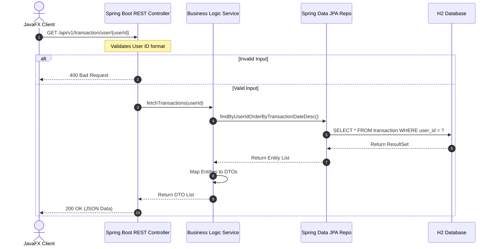
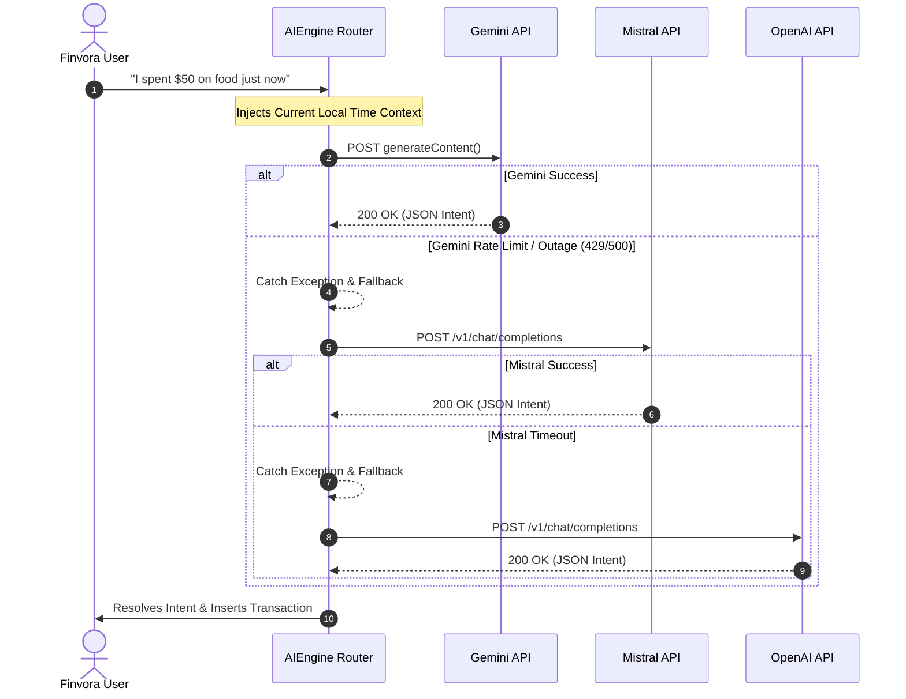
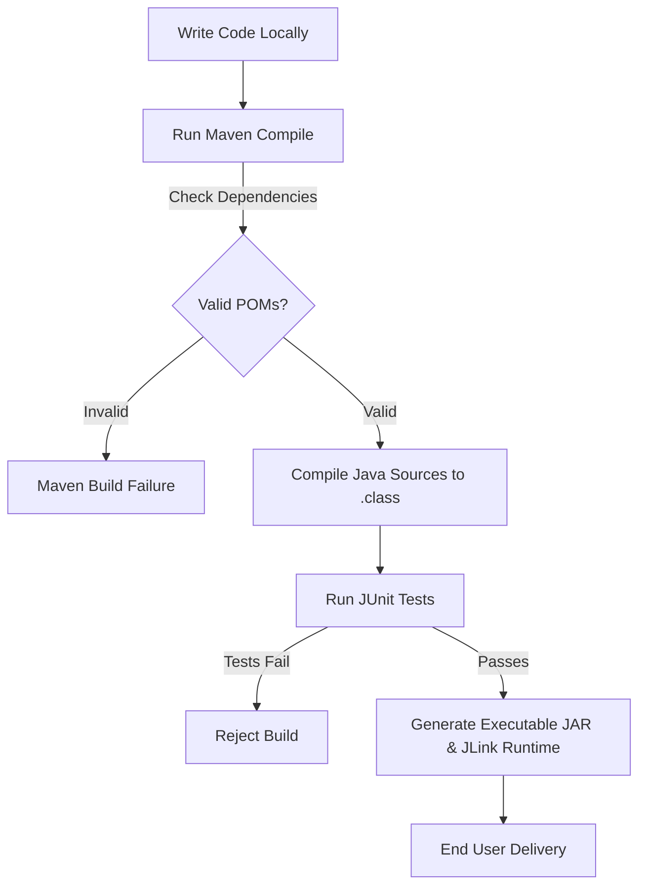

# System Architecture & Diagrams

This document details the system design, communication protocols, request lifecycles, and security boundaries of the Finvora Finance Tracker environment.

---

## 🏗️ High-Level System Architecture

Finvora uses a highly decoupled Client-Server architecture to facilitate rapid local operations backed by powerful cloud AI processing.

```mermaid
graph TD
    subgraph Client Layer
        A[JavaFX Desktop App]
    end

    subgraph Internal Network Interfaces
        B[Local HTTP API Gateway]
        C[File System (PDF / CSV)]
    end

    subgraph Server Services
        D[Spring Boot REST Controller]
        E[AI Routing Engine]
        F[AIVision & AIVoice Services]
    end

    subgraph External AI APIs
        Gemini[Google Gemini API]
        Mistral[Mistral API]
        OpenAI[OpenAI API]
    end

    subgraph Storage Layer
        G[(H2 Local Database)]
    end

    A -->|HTTP Requests| B
    A -->|File I/O| C
    B --> D
    A --> E
    A --> F
    D --> G
    
    E -->|Primary LLM| Gemini
    E -.->|Fallback 1| Mistral
    E -.->|Fallback 2| OpenAI
```

---

## 🚦 Request & Data Lifecycles

### 1. HTTP REST Authentication & Data Lifecycle

Below is the sequence of auth verification and header mapping when accessing the local Spring Boot backend:



### 2. Multi-LLM Resilient AI Routing Flow

The AI Intent Router uses a cascading fallback mechanism to ensure 100% uptime when making API queries.



---

## 🛡️ Security Boundaries

We isolate operational layers to block arbitrary access to user financial data:

```mermaid
graph LR
    subgraph Desktop OS Environment
        A[JavaFX App Process]
    end

    subgraph Secure Local Perimeter (127.0.0.1)
        B[Spring Boot App Router]
    end

    subgraph Internal File System (No External Access)
        D[(H2 Database file .db)]
    end

    subgraph Public Internet
        E[External AI Providers]
    end

    A -->|REST API over localhost| B
    B -->|JPA JDBC Connection| D
    A -->|HTTPS / TLS 1.3| E
```

---

## 💻 Developer Workflow

The lifecycle of developer updates from local editor to final application compilation:


